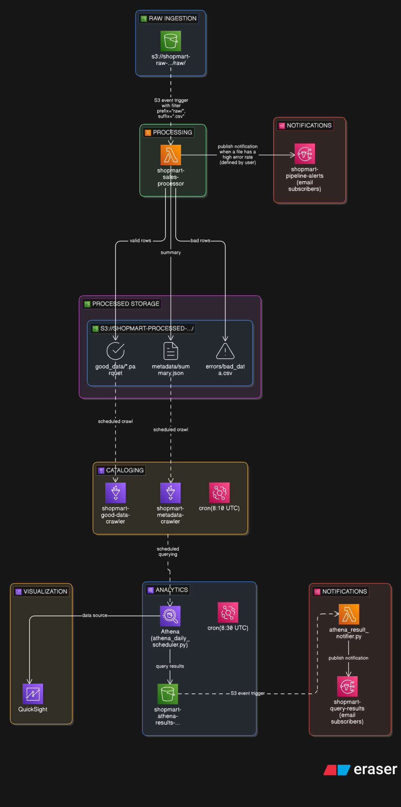

# ShopMart Sales Data Pipeline

Automated daily sales data pipeline on AWS. Replaces the BI team's manual
Excel process (3-4 h/day) with an event-driven serverless pipeline.

---

## Architecture overview



---

## Project structure

```
.
├── src/
│   ├── processor.py              # Core processing logic + Lambda handler
│   ├── athena_result_notifier.py # Notifies on Athena result files
│   ├── athena_daily_scheduler.py # Runs daily Athena query batch via EventBridge
│   └── athena_daily_queries.sql  # Named Athena queries (run daily or manually)
│ 
├── tests/
│   ├── test_processor.py     # pytest test suite (20+ cases)
│   └── fixtures/
│       ├── valid_data.csv
│       └── dirty_data.csv
├── infra/
│   ├── app.py                # CDK app entry point
│   ├── cdk.json              # CDK context config
│   └── stacks/
│       └── pipeline_stack.py # Full AWS infrastructure
├── store_00_20260418.csv     # Sample input data
├── requirements.txt          # Local dev requirements
└── pyproject.toml            # pytest configuration
```

---

## Quick start (local)

### 1. Set up a virtual environment

```bash
python3 -m venv .venv
source .venv/bin/activate
pip install -r requirements.txt
```

### 2. Run the tests

```bash
pytest
```

All tests should pass:

```
tests/test_processor.py::TestValidateSchema::test_passes_with_all_required_columns PASSED
tests/test_processor.py::TestValidateSchema::test_fails_when_column_is_missing PASSED
...
43 passed
```

### 3. Process a file locally (REPL / script)

```python
from src.processor import process_file

with open("store_00_20260418.csv") as f:
    csv_text = f.read()

good_df, bad_df, summary = process_file(csv_text, source_key="store_00_20260418.csv")

print(summary)
print(good_df[["order_id", "quantity", "unit_price"]])
print(bad_df[["order_id", "validation_errors"]])
```

---

## Data processing rules

| Check | Action |
|---|---|
| Missing required columns | Raise `ValueError` — reject entire file |
| Duplicate rows | Flag as bad (`duplicate_row`) |
| Missing quantity / unit_price | Flag as bad |
| Negative or zero quantity | Flag as bad (`non_positive_quantity`) |
| Negative or zero unit_price | Flag as bad (`non_positive_unit_price`) |
| `payment_status` ∉ {paid, pending, failed} | Flag as bad |
| All other rows | Compute `line_revenue = quantity × unit_price` |

Aggregations written to `summary.json`:
- `daily_revenue` by `order_date`
- `top_products` (top 10 by total revenue)
- `orders_per_customer`
- `payment_success_rate`

---

## Infrastructure (AWS CDK — Part 4)

### Prerequisites

- Python ≥ 3.12
- Node.js ≥ 20 (CDK CLI)
- AWS CLI configured with deploy permissions
- Docker (only required when deploying; not needed for `cdk synth`)

```bash
npm install -g aws-cdk
cd infra
pip install -r requirements.txt
```

### Synth (validate without deploying)

```bash
cd infra
cdk synth
```

Expected output: CloudFormation template printed to stdout, no errors.

This project stores default CDK context in `infra/cdk.json`, so deploy/destroy/synth
commands work without repeating `--context` flags.

Before running CDK commands, populate these values in `infra/cdk.json`:
- `account`
- `region`
- `alertEmail`

### Deploy

```bash
# First-time bootstrap (once per account/region)
cdk bootstrap aws://YOUR_ACCOUNT_ID/YOUR_AWS_REGION

# Deploy
cdk deploy --require-approval never
```

To use a different account, region, or alert email, either edit `infra/cdk.json` or
override on one command with `-c`, for example:

```bash
cdk deploy -c region=us-east-1
```

### Useful context overrides

| Key | Default | Description |
|---|---|---|
| `errorThreshold` | `0.20` | Bad-row rate above which SNS fires |
| `pandasLayerArn` | auto-resolved | Override the AWSSDKPandas layer ARN |
| `athenaResultsOwnerArn` | `arn:aws:iam::YOUR_ACCOUNT_ID:user/YOUR_USER` | IAM principal granted read/write access to Athena result bucket |

### Resources created

| Resource | Name pattern |
|---|---|
| S3 raw bucket | `shopmart-raw-<account>-<region>` |
| S3 processed bucket | `shopmart-processed-<account>-<region>` |
| S3 Athena results bucket | `shopmart-athena-results-<account>-<region>` |
| Lambda function | `shopmart-sales-processor` |
| Lambda function | `shopmart-athena-result-notifier` |
| Lambda function | `shopmart-athena-daily-scheduler` |
| SNS topic | `shopmart-pipeline-alerts` |
| SNS topic | `shopmart-query-results` |
| Glue database | `shopmart_sales` |
| Glue crawler | `shopmart-good-data-crawler` |
| Glue crawler | `shopmart-metadata-crawler` |
| CloudWatch alarm (errors) | `shopmart-processor-errors` |
| CloudWatch alarm (duration) | `shopmart-processor-duration-p99` |

### Destroy (teardown)

Buckets use `RemovalPolicy.DESTROY` in this project configuration.
To clean up all resources:

```bash
cdk destroy --force
```

---

## Using the pipeline

1. Upload a store CSV to `s3://shopmart-raw-<account>-<region>/raw/`
2. Lambda triggers automatically within seconds, you may receive some emails if your data contain high error rate
3. Find results at:
  - `s3://shopmart-processed-<account>-<region>/processed/good_data/store=01/date=2026-04-18/part-0000.parquet`
  - `s3://shopmart-processed-<account>-<region>/metadata/store=01/date=2026-04-18/summary.json`
  - `s3://shopmart-processed-<account>-<region>/errors/store=01/date=2026-04-18/bad_data.csv` *(if any bad rows)*
4. Run `aws glue start-crawler --name shopmart-good-data-crawler` and `aws glue start-crawler --name shopmart-metadata-crawler` (or wait for scheduled daily run at 08:10 UTC)
5. In Athena, set query result location to `s3://shopmart-athena-results-<account>-<region>/athena-results/`
6. Run sample queries from `src/athena_daily_queries.sql` (or wait for scheduled daily run at 08:30 UTC for some fixed queries to be run)
7. Each new Athena `.csv` result in `athena-results/` triggers `shopmart-athena-result-notifier`, which publishes an SNS notification with bucket/key details to `shopmart-query-results`
8. Connect QuickSight to Athena as the data source for dashboards

---

## Business requirements coverage

| BR | Requirement | Implementation |
|---|---|---|
| BR-1 | Auto-process on upload | S3 event → Lambda trigger |
| BR-2 | Validate + separate bad rows | `clean_and_validate_rows()` → `errors/` prefix |
| BR-3 | Daily revenue, top products, payment rate | `compute_metrics()` → `summary.json` |
| BR-4 | Analytics-friendly storage | Parquet in S3 |
| BR-5 | Alert on quality issues | SNS publish when `bad_row_rate >= threshold` |
| BR-6 | BI tool ready | Glue Catalog + Athena + QuickSight |
| BR-7 | Track processed file metadata | `summary.json` per file |
| BR-8 | Automatic retry on failure | Lambda `retry_attempts=2` |
